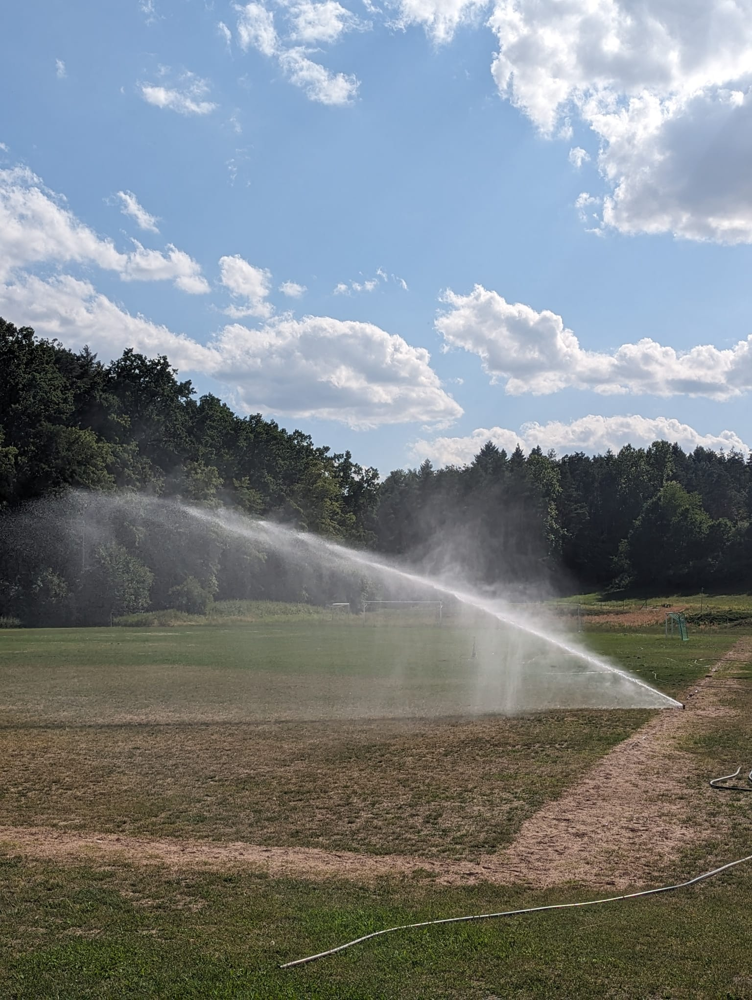

Die immer stärker werdende Trockenheit im Sommer hat in den letzten Jahren dazu geführt,
dass durch die fehlende regelmäßige Bewässerung unser Trainingsplatz immer wieder größere Schäden erlitten hat.

Vor allem war der Aufwand mit den vorhandenen flexiblen Rasensprengern enorm hoch und nicht effektiv genug.
Außerdem ist die Beregnung mit normalem Leitungswasser sehr teuer.

Es wurde daher eine neue Beregnungsanlage von der Fa. Gechter mit Unterstützung von Vereinsmitgliedern errichtet.
Mit insgesamt 15 Rasensprenger kann nun eine gleichmäßige, regelmäßige und vor allem effektive Bewässerung des Trainingsplatzes erfolgen.
Für die Wasserversorgung wurde zusätzlich eine Zisterne installiert, die ab dem nächsten Jahr über einen Brunnen versorgt werden soll.
Somit wird 2025 eine weitere Investition für einen Brunnenbau erfolgen.

Der Bau der Beregnungsanlage wird gefördert durch den Bayerischen Landessportverband mit 45 % und der Gemeinde Bischberg mit 20 %.
Für den Bau des Brunnens ist eine Förderung in der gleichen Höhe eingeplant.

