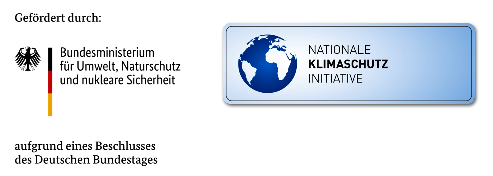

Der 1. FC Bischberg 1926 e. V. hat seine alte Flutlichtanlage mit
Quecksilberdampflampen im Februar 2024 auf LED-Technik umgerüstet.
Gefördert wurde das ganze Projekt vom Bundesministerium für Umweltschutz,
der Organisation Zukunft – Umwelt – Gesellschaft, Z. U. G. mit 25 %, vom Bayerischen
Landessportverband mit 45 % und von der Gemeinde Bischberg mit 20 %.
Ausgeführt wurden die Arbeiten von einer ortsansässigen Firma,
der Fa. Elektro Weis aus Trosdorf.

### Technische Daten

Die neue Anlage besteht aus 8 LED-Flutern. Dank der wesentlich besseren
Lichtausbeute reicht für den Trainingsbetrieb eine 50% Auslastung aus.

Jährliche Stromeinsparung aller Leuchtensysteme: 7.102 kWh/a  
Durchschnittliche Stromeinsparung aller Leuchtensysteme: 60,70 %  
CO2-Einsparung nach 20 Jahren aller Leuchtensysteme: 62 t  
Vermeidungskosten gesamt: 561,96 €/t = somit insgesamt ca. 35 000 Euro in 20 Jahren.  
Somit jährlich ca. 1500 bis 1800 Euro, abhängig vom aktuellen Strompreis.  
Der 1. FC Bischberg leistet somit einen wichtigen Beitrag zum Umweltschutz.

### Nationale Klimaschutzinitiative

> Mit der Nationalen Klimaschutzinitiative initiiert und fördert das Bundesumweltministerium
> seit 2008 zahlreiche Projekte, die einen Beitrag zur Senkung der Treibhausgasemissionen
> leisten. Ihre Programme und Projekte decken ein breites Spektrum an Klimaschutzaktivitäten
> ab: Von der Entwicklung langfristiger Strategien bis hin zu konkreten Hilfestellungen und
> investiven Fördermaßnahmen. Diese Vielfalt ist Garant für gute Ideen. Die Nationale
> Klimaschutzinitiative trägt zu einer Verankerung des Klimaschutzes vor Ort bei. Von ihr
> profitieren Verbraucherinnen und Verbrauchen ebenso wie Unternehmen, Kommunen oder
> Bildungseinrichtungen.

