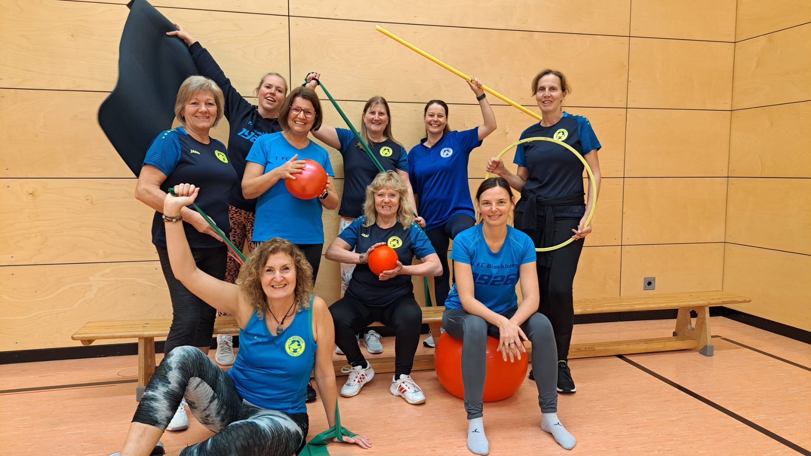

**Die Gruppe besteht aus derzeit 10-15 Frauen.**
**Wir trainieren jeden Mittwoch 19 Uhr in der Grundschulturnhalle**

> Bleib fit, mach mit!

Lust auf:

Fitness- und Problemzonengymnastik mit guter Musik, gute Laune, Spaß und a weng
Muskelkater?

Dann schau vorbei!

In den Sommermonaten, wenn die Halle zu heiß wird, gehen wir walken oder fahren Rad.

Am letzten Mittwoch im Monat klingen wir nach dem Sport zusammen den Abend aus.

Probier es aus! Wir freuen uns auf dich!

Ansprechpartnerinnen:

- Michaela Schlauch (Trainerin) Tel. [016091136986](tel:016091136986)
- Carola Gerhardt (Abteilungsleiterin) Tel. [0951 7002465](tel:09517002465)
