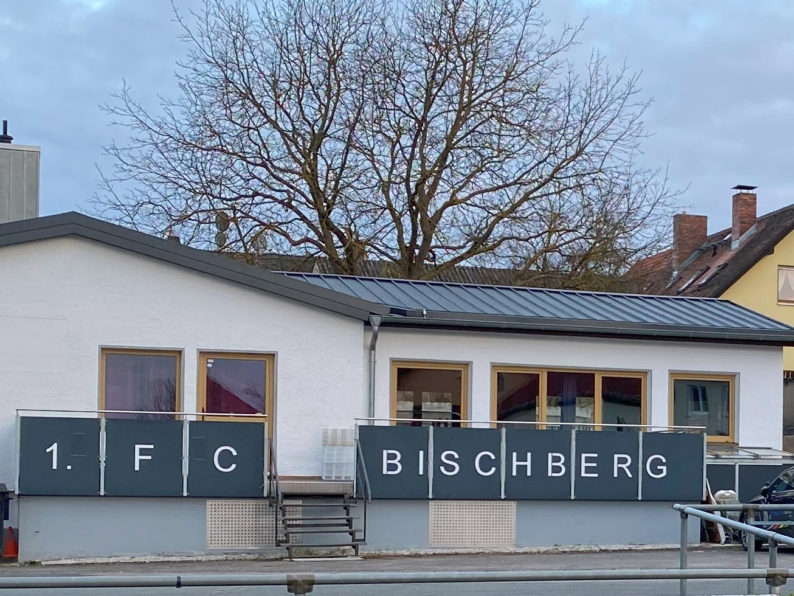
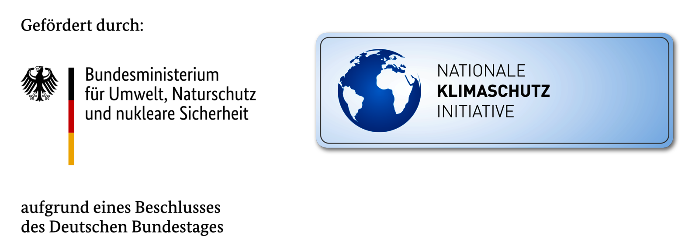

import Sponsors from "../components/Sponsors.astro";

Im Jahre 1926 fand sich In der Brauerei Leicht ein kleines Häuflein junger
Sportsleute zusammen, um den Rasensport zu pflegen. Es wurde der Verein
mit dem Namen

> 1.FC Bischberg 1926

gegründet. Der Verein stützt sich lediglich auf Körperpflege und Geselligkeit
und auch seine Mitglieder auf dem Gebiete des Fußballsports auszubilden.

### Investitionen am Trainingsgelände 2023/2024

Der 1. FC Bischberg hat kräftig in seine Infrastruktur investiert,
das Trainingsgelände wieder zukunftsfähig gemacht und die Trainingsbedingungen damit stark verbessert.

- [Bau einer neuen Beregnungsanlage](/bau-beregnungsanlage)
- [Sanierung der Rasenfläche](/sanierung-rasenflaeche)
- [Flutlichtanlage auf LED umgerüstet](/flutlicht-led)  
  Gefördert wurde die Flutlichtanlage vom Bundesministerium für Umwelt, Naturschutz und nukleare Sicherheit
  aufgrund eines Beschlusses des Deutschen Bundestages.  
  [Mehr zu allen Themen](https://www.klimaschutz.de)

### Einen herzlichen Dank an unsere Sponsoren

<Sponsors />
