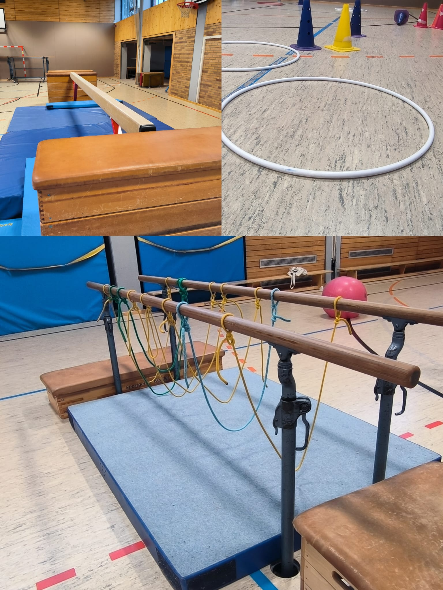

Aktuell sind alle Stunden belegt und auch die Warteliste ist voll

> Erlaubt ist was gefällt und die Kinder bewegt.

Bewegung ist wichtig... auch schon für die Kleinsten...auch einfach mal laut sein dürfen, gehört bei uns dazu.

Beim Kinderturnen geht es um Spaß, Bewegung und das Miteinander. Nach dem Aufwärmen gibt es oft eine Bewegungslandschaft in die auch gerne Elemente eingebaut werden die die Kinder sich wünschen.

Bei uns Turnen Kinder ab 2 Jahren so lange sie Spaß daran haben. Kinder bis 4 Jahre kommen mit einer erwachsenen Begleitperson.

Aktuell gibt es eine Stunde am Samstag Vormittag und zwei Stunden am Donnerstag Nachmittag. In den Ferien finden keine Stunden statt.

Für weitere Informationen meldet euch gerne direkt bei mir.

[katrin.weiss80@web.de](mailto://katrin.weiss80@web.de)

Viele Grüße,

[Katrin Weiß](mailto://katrin.weiss80@web.de)
