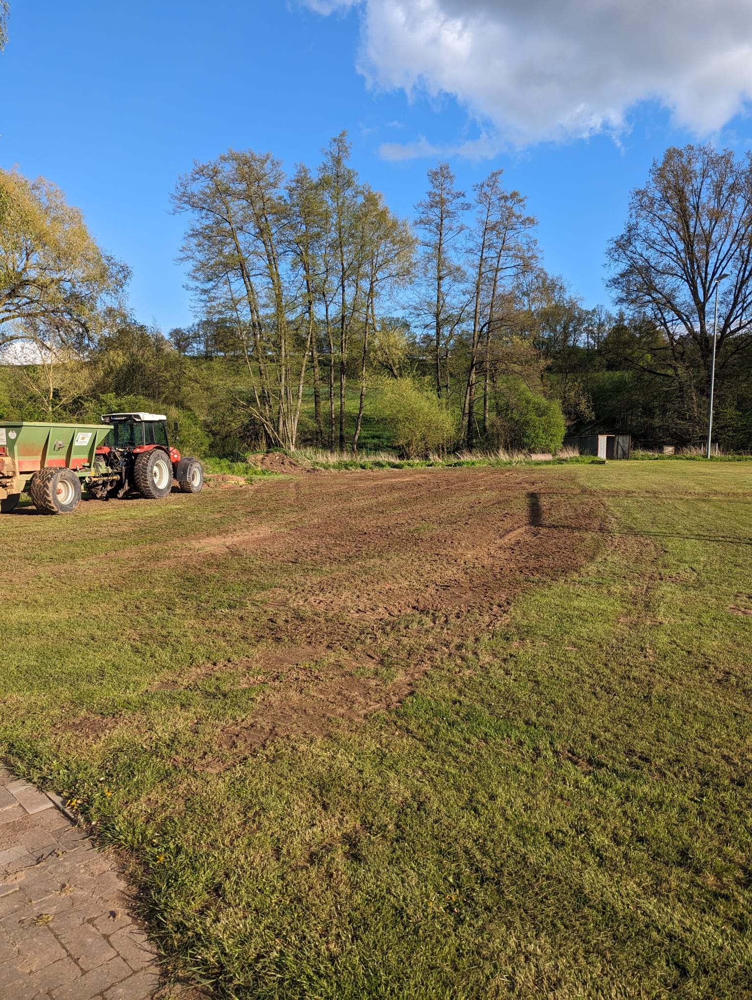

Die Rasenfläche des Trainingsplatzes wurde durch die Vielzahl an Mannschaften in den letzten Jahren stark beansprucht.
Vor allem die Schäden durch einen Wühlmaus- und Maulwurfbefall waren enorm.

Von der Fa. Held aus Trabelsdorf haben wir daher Unkraut vernichten lassen, Humus und Sand einarbeiten lassen, somit den Platz aerifiziert.
Außerdem haben wir eine Tiefenlockerung durchgeführt und den Boden belüften lassen, sowie eine [Sperre wegen des Maulwurfbefalles](/bau-beregnungsanlage) einbauen lassen.

Der Platz befindet sich daher wieder in einem guten Zustand, Wühlmäuse und Maulwürfe sind jedoch leider noch teilweise vorhanden.

Die Kosten des Sandes wurden von der Gemeinde übernommen, der restliche Teil wurde von Vereinsseite getragen.

